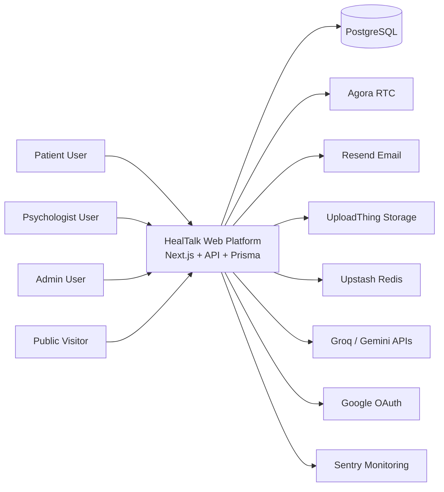
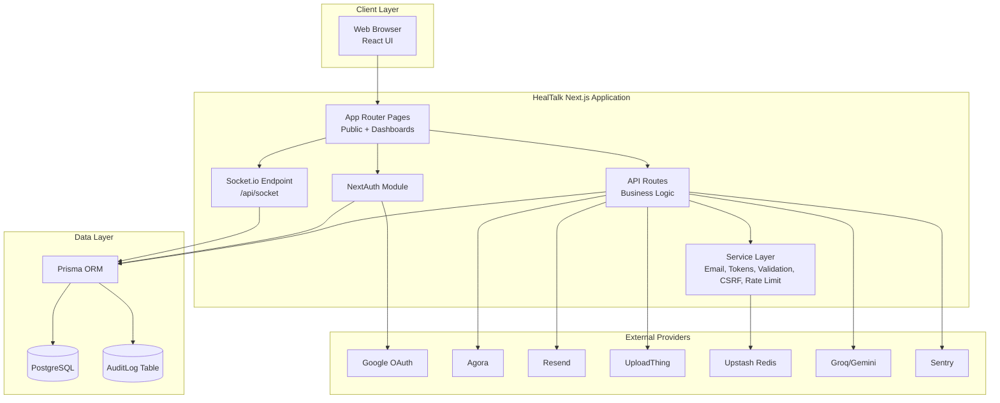
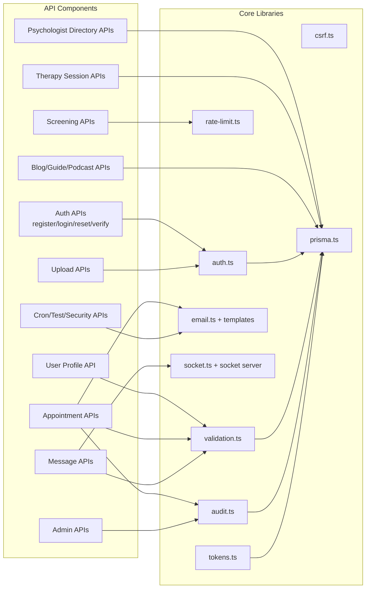
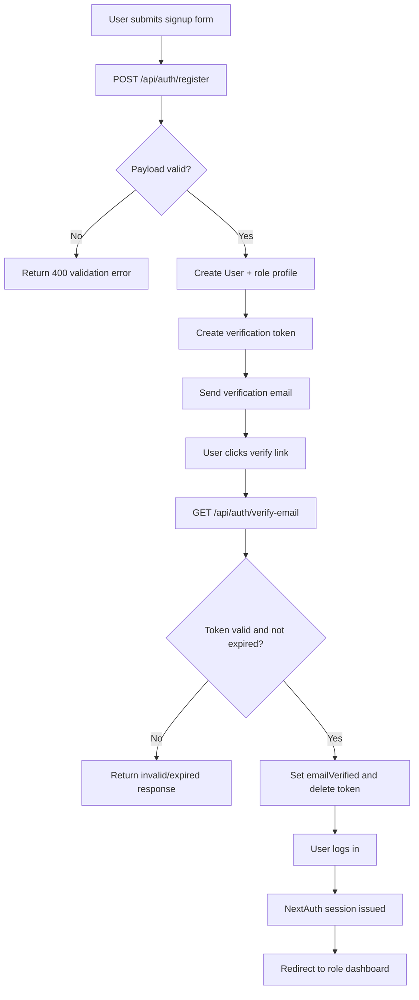
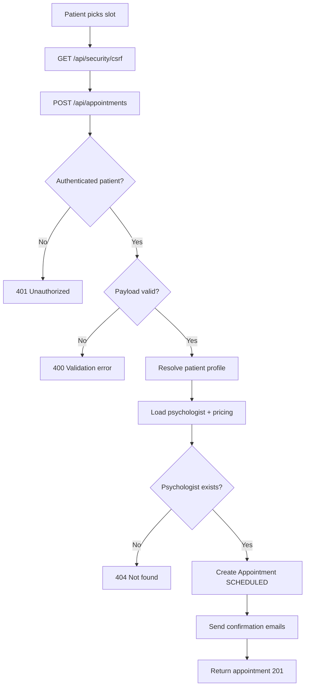
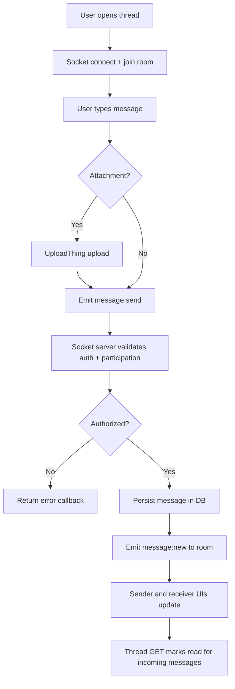
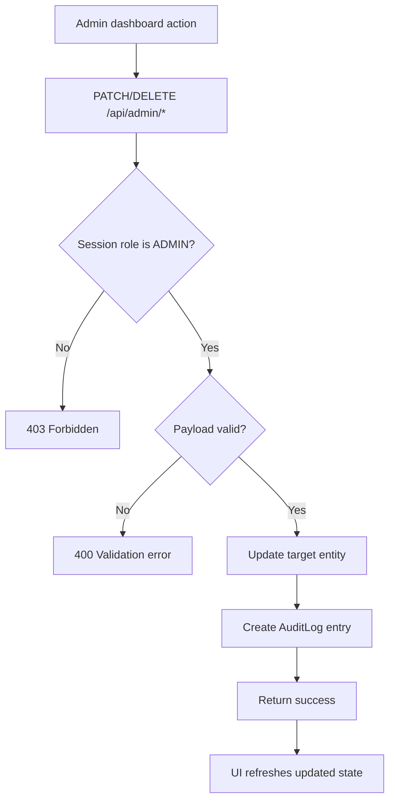

# Software Requirements Specification

## 1. Title Page

**System Name:** HealTalk (Repository name: psyconnect)  
**Document Name:** Software Requirements Specification (SRS)  
**Version:** 1.0 (Initial Draft)  
**Date:** February 12, 2026  
**Author:** AI (Codex)  
**Document Status:** Draft

---

## 2. Revision History

| Version | Date | Author | Changes |
|---|---|---|---|
| 0.1 | February 12, 2026 | AI | First full draft created from repository analysis |
| 0.2 | February 12, 2026 | AI | Added complete endpoint catalog, diagrams, and traceability tables |
| 1.0 | February 12, 2026 | AI | Finalized structure, FR/NFR IDs, assumptions, and acceptance mappings |

---

## 3. Table of Contents

1. Title Page  
2. Revision History  
3. Table of Contents  
4. Purpose & Scope  
5. Overall Description  
6. Definitions, Acronyms, Abbreviations (Glossary)  
7. Stakeholders & User Roles  
8. Use Cases  
9. Functional Requirements (Phase by Phase)  
10. Non-Functional Requirements (NFR)  
11. System Architecture  
12. Data Model  
13. Data Flow Explanation (Step by Step)  
14. API & Integration Requirements  
15. UI/UX Requirements  
16. Logging, Monitoring, and Audit  
17. Security Requirements (Detail)  
18. Deployment & Environment Requirements  
19. Testing & Acceptance Plan  
20. Traceability Matrix  
21. Risks & Mitigations  
22. Future Enhancements / Roadmap

---

## 4. Purpose & Scope

### 4.1 Purpose of this SRS

This Software Requirements Specification (SRS) explains what the HealTalk system must do, how it should behave, and what quality levels it must meet.

This document is based on the real code in this repository, including:

- Next.js pages in `src/app/**`
- API routes in `src/app/api/**`
- Database schema in `prisma/schema.prisma`
- Auth and security logic in `src/lib/auth.ts`, `src/proxy.ts`, `src/lib/csrf.ts`, `src/lib/rate-limit.ts`
- Realtime messaging with Socket.io in `src/pages/api/socket.ts`
- Video call integration with Agora in `src/components/video/**` and `src/app/api/agora/token/route.ts`
- Admin and moderation workflows in `src/app/(dashboard)/admin/**` and related admin APIs

The goal is to make implementation, QA, product planning, and stakeholder communication clear and consistent.

### 4.2 Product Scope (What the system does)

HealTalk is a role-based mental health platform for:

- Patients who search psychologists, book sessions, chat, join video calls, and track wellbeing.
- Psychologists who manage patients, sessions, messages, and profile details.
- Admins who approve psychologists, moderate content, manage users, and view platform analytics.

Core delivered capabilities found in code:

1. Account registration, login, Google OAuth, email verification, and password reset.
2. Role-based dashboards for Patient, Psychologist, and Admin.
3. Psychologist directory and profile details.
4. Appointment booking, listing, update, and reminders.
5. Real-time and persisted messaging.
6. 1-on-1 and group session flows with Agora token-based join authorization.
7. AI-supported screening and a public chatbot.
8. Content modules (blog, guides, podcasts).
9. Admin management for users, psychologists, hospitals, reviews, and blog publishing state.
10. Security controls: validation, rate limit, CSRF helper, security headers, and audit logs.

### 4.3 Out of Scope (Explicit)

The following items are out of scope in current production behavior of this repository:

1. Real payment gateway charge processing (Stripe checkout, webhook, refunds, payout automation) is not fully implemented.
2. Full accounting and invoice legal workflows are not implemented.
3. Deep EHR or hospital information system integration is not present.
4. SMS notifications are not implemented.
5. Native mobile apps (iOS/Android) are not implemented.
6. Full clinical protocol engine for diagnosis/treatment plans is not implemented.
7. Automated emergency escalation workflow for CRISIS screening is not completed (code has TODO markers).
8. Full end-to-end test suite for all critical paths is not complete.

---

## 5. Overall Description

### 5.1 Product Perspective

HealTalk is a web platform built with Next.js App Router and PostgreSQL (Prisma). It is a multi-module SaaS-style application where public pages, authenticated dashboards, API routes, and service integrations work together.

It sits in a broader ecosystem that includes:

- Identity providers: Credentials + Google OAuth
- Communications providers: Agora (video), Socket.io (realtime transport)
- File storage provider: UploadThing
- Email provider: Resend
- AI providers/libraries: Groq and Gemini packages
- Infrastructure/ops providers: Upstash Redis (rate limiting), Sentry (error monitoring)

### 5.2 Product Functions (High level)

- User registration and login with role handling
- Email verification and password reset
- User profile update and role-specific profile data
- Psychologist discovery and filtering
- Session booking and appointment management
- Email reminders and notifications for appointment events
- Secure patient-psychologist messaging
- Video call access for authorized participants
- Group therapy session creation and enrollment
- AI screening and result history for patients
- Public mental health support chatbot
- Admin dashboards and moderation tools
- Audit trail creation for sensitive operations

### 5.3 User Classes and Characteristics

1. Patient
- Usually needs a simple, guided experience.
- Wants trust, privacy, and easy booking.
- Uses search, booking, messaging, screening, and progress tools.

2. Psychologist
- Needs profile and credential visibility.
- Needs schedule, session, and patient management tools.
- Uses messaging and call features for active care.

3. Admin
- Needs high-level visibility and control.
- Handles approvals, moderation, policy enforcement, and reporting.
- Performs sensitive actions that need audit logs.

4. Guest / Public visitor
- No login needed for informational pages.
- Can browse resources and use public chatbot.
- Can browse psychologist directory and profile pages.

### 5.4 Operating Environment

Frontend:

- Next.js 16.1.4 with React 19.2.3
- TypeScript
- Tailwind CSS and component library patterns
- Browser-based UI (desktop and mobile responsive behavior)

Backend:

- Next.js route handlers under `src/app/api`
- Node.js runtime for server logic
- NextAuth for auth/session

Database:

- PostgreSQL via Prisma ORM
- Schema defined in `prisma/schema.prisma`

Realtime / Media:

- Socket.io endpoint at `/api/socket`
- Agora RTC for video and screen share

Deployment assumptions from repository docs/scripts:

- Designed for Vercel-style deployment and also VM-based deployment (`deploy.sh`)
- Environment-separated config for dev/staging/prod
- External services via API keys in `.env`

### 5.5 Design and Implementation Constraints

1. Must preserve Next.js App Router architecture and existing file layout.
2. Must preserve role-based access model (`PATIENT`, `PSYCHOLOGIST`, `ADMIN`).
3. Must use PostgreSQL with Prisma schema as system-of-record.
4. Must use existing APIs and contracts for current UI pages.
5. Sensitive routes require authenticated session and role checks.
6. Many operations already assume cents-based money values in data layer.
7. Certain security controls are conditional by environment (CSRF enforcement in production with `CSRF_SECRET`).

### 5.6 Assumptions and Dependencies

Assumptions (explicit, because code/docs have some gaps or mismatches):

1. **Assumption:** Product brand in user-facing text is "HealTalk" while package/repository technical name is "psyconnect".
2. **Assumption:** Current environment is intended to run in United States or multi-region internet context, but legal pages include HIPAA references and should be reviewed by legal counsel before launch.
3. **Assumption:** Payment model in UI is informational in current release; actual payment settlement is a future phase.
4. **Assumption:** Blog, guide, and podcast content are not regulated clinical guidance; they are educational content.
5. **Assumption:** Group session cancellation refund logic is a target requirement but currently not completed in backend.
6. **Assumption:** Email templates and public page copy may contain legacy text and require editorial cleanup before go-live.
7. **Assumption:** CSRF is expected to be fully enabled in production with proper secret configuration.
8. **Assumption:** Admin users are trusted operators; however, all sensitive actions still require logs and review.

Hard dependencies:

- PostgreSQL availability and migration state
- NextAuth secret and URL configuration
- External service keys: Agora, Resend, UploadThing, Upstash, AI provider keys
- Browser permissions for camera/microphone for call functions

---

## 6. Definitions, Acronyms, Abbreviations (Glossary)

| Term | Meaning |
|---|---|
| API | Application Programming Interface |
| App Router | Next.js routing system used in `src/app` |
| CSRF | Cross-Site Request Forgery protection |
| OAuth | Third-party sign-in flow (Google in this project) |
| RBAC | Role-Based Access Control |
| JWT | JSON Web Token used by NextAuth session strategy |
| PHI | Protected Health Information |
| HIPAA | US healthcare privacy/security regulation |
| GDPR | EU privacy regulation |
| SRS | Software Requirements Specification |
| FR | Functional Requirement |
| NFR | Non-Functional Requirement |
| UTC | Coordinated Universal Time |
| CUID | Collision-resistant unique ID format used by Prisma |
| Rate Limiting | Throttling requests to reduce abuse |
| Audit Log | Persistent record of sensitive user/admin actions |
| Therapy Session | Group or one-on-one scheduled session entity |
| Screening Assessment | AI-assisted patient questionnaire results |
| CRISIS risk level | Highest screening risk state requiring urgent response |

---

## 7. Stakeholders & User Roles

### 7.1 Stakeholder Groups

1. Patients
- Need safe and easy access to care.
- Need trusted providers and clear booking/messaging flows.

2. Psychologists
- Need operational tools and secure communication.
- Need profile management and professional presentation.

3. Platform Administrators
- Need governance controls for quality and safety.
- Need moderation and analytics visibility.

4. Product and Engineering Team
- Need stable architecture, maintainable code, and clear requirement traceability.

5. Compliance and Security Reviewers
- Need clear controls around auth, audit, privacy, and incident handling.

### 7.2 Role Table

| Role | Permissions | Key Activities |
|---|---|---|
| Guest | Access public pages and public chatbot; no protected data | Browse homepage, psychologist directory, resources; ask public chatbot questions |
| Patient | Manage own account/profile; book appointments; message assigned psychologists; join authorized calls; use screening/progress/favorites | Register/login, find psychologist, book, chat, attend sessions, track mood/screening |
| Psychologist | Manage own profile/settings; create/manage sessions; view own appointments/patients; message assigned patients; join authorized calls | Maintain professional profile, schedule work, run sessions, communicate with patients |
| Admin | View platform metrics; approve/reject/suspend psychologists; manage users; moderate reviews/blog publish state; view hospitals | Operate governance and moderation, monitor platform health, enforce policy |

### 7.3 Authentication and Authorization Overview

Authentication:

- NextAuth with Credentials provider and Google provider.
- Credentials login checks hashed password (`bcrypt`) and requires verified email.
- Google users are auto-verified and auto-provisioned as patient if no role-specific profile exists.

Authorization:

- Route-level protection in `src/proxy.ts` for dashboard route groups.
- API-level checks use `getServerSession(authOptions)` and role checks in each route.
- Status checks (`ACTIVE`, `SUSPENDED`, `BANNED`) gate sign-in and route access.

Session model:

- JWT session strategy with custom claims (`id`, `role`, `emailVerified`, `status`).
- Session/user type extension defined in `src/types/next-auth.d.ts`.

---

## 8. Use Cases

The following use cases describe major user journeys in current code.

### UC-01: User Registration with Email Verification

- **Primary Actor:** New Patient or New Psychologist
- **Preconditions:** User is not logged in; email is not already registered.
- **Main Success Flow:**
1. User opens `/signup`.
2. User enters name, email, password, confirm password.
3. System sends `POST /api/auth/register`.
4. Backend validates input and role-specific fields.
5. Backend creates `User` and role profile (`Patient` or `Psychologist`).
6. Backend creates verification token and sends verification email.
7. User opens link in `/verify-email?token=...`.
8. Backend verifies token and marks `emailVerified` timestamp.
9. User can now sign in.
- **Alternative Flows:**
1. User signs in with Google instead; system auto-verifies and creates patient profile.
2. User registers as psychologist with additional profile fields.
- **Error/Exception Flows:**
1. Email already exists returns 409.
2. Invalid payload returns 400.
3. Verification token invalid/expired returns 400.
- **Postconditions:** Account exists; verification status is stored; audit log entry for registration and email verification.

### UC-02: User Login and Role-Based Dashboard Routing

- **Primary Actor:** Existing Patient, Psychologist, or Admin
- **Preconditions:** User account exists; credentials are correct; account is ACTIVE.
- **Main Success Flow:**
1. User opens `/login`.
2. User submits credentials or Google OAuth.
3. NextAuth validates identity and user status.
4. Session token is issued with role and user ID.
5. Frontend routes user to role dashboard (`/patient/dashboard`, `/psychologist/dashboard`, or `/admin/dashboard`).
- **Alternative Flows:**
1. OAuth login path via Google and redirect through `/oauth-redirect`.
- **Error/Exception Flows:**
1. Invalid credentials denied.
2. Unverified credentials account denied.
3. Suspended/Banned account denied.
- **Postconditions:** Authenticated session is active in browser.

### UC-03: Patient Searches and Views Psychologist Profile

- **Primary Actor:** Patient (or Guest)
- **Preconditions:** Public site is available.
- **Main Success Flow:**
1. User opens `/find-psychologists`.
2. System requests `GET /api/psychologists` with filters.
3. User selects one profile.
4. System opens profile route and requests `GET /api/psychologists/{id}`.
5. System shows approved psychologist details and latest approved reviews.
- **Alternative Flows:**
1. User applies filters (specialization, price, rating, search text).
- **Error/Exception Flows:**
1. Profile not found returns 404.
2. Non-approved psychologist returns 403.
- **Postconditions:** User has enough data to decide whether to book.

### UC-04: Patient Books Appointment

- **Primary Actor:** Patient
- **Preconditions:** User is logged in as patient; psychologist exists and is viewable.
- **Main Success Flow:**
1. User chooses date/time on profile booking widget.
2. User goes to `/checkout` with selected details.
3. Client obtains CSRF token from `GET /api/security/csrf`.
4. Client sends `POST /api/appointments`.
5. Backend validates payload and participant rules.
6. Backend creates appointment with computed price (`price60`/`price90`).
7. Backend sends confirmation emails to patient and psychologist.
8. Appointment appears in both dashboards.
- **Alternative Flows:**
1. If patient profile missing, backend auto-creates patient record.
- **Error/Exception Flows:**
1. Unauthorized returns 401.
2. Invalid date/time returns 400.
3. Psychologist missing returns 404.
- **Postconditions:** Appointment exists with status `SCHEDULED`.

### UC-05: Psychologist or Participant Updates Appointment Status/Time

- **Primary Actor:** Psychologist, Patient participant, or Admin
- **Preconditions:** Appointment exists; actor is participant or admin.
- **Main Success Flow:**
1. Actor sends `PATCH /api/appointments/{id}`.
2. Backend validates permission and payload.
3. Backend updates status/date/time fields.
4. Audit log entry is written.
5. Cancellation or reschedule email notifications are sent.
- **Alternative Flows:**
1. Admin can update even if not participant.
- **Error/Exception Flows:**
1. Appointment not found returns 404.
2. Actor not authorized returns 403.
3. Invalid dates return 400.
- **Postconditions:** Appointment reflects latest valid state.

### UC-06: Patient and Psychologist Exchange Messages

- **Primary Actor:** Patient or Psychologist
- **Preconditions:** Both users are linked by an appointment.
- **Main Success Flow:**
1. User opens messages page and conversation list.
2. Client requests `GET /api/messages/conversations`.
3. User opens a thread by appointment ID.
4. Client requests `GET /api/messages/{appointmentId}`.
5. Backend returns thread and marks incoming unread messages as read.
6. User sends message using socket event `message:send`.
7. Server persists message and broadcasts `message:new`.
8. Other side receives message in real time.
- **Alternative Flows:**
1. If socket fallback needed, client can `POST /api/messages/{appointmentId}` text-only.
2. User uploads attachment via UploadThing route then sends attachment payload over socket.
- **Error/Exception Flows:**
1. Non-participant blocked with 403.
2. Appointment not found returns 404.
3. Socket failure triggers fallback and user-visible error.
- **Postconditions:** Message persisted in `Message` table; read states updated over time.

### UC-07: Authorized User Joins 1-on-1 Video Call

- **Primary Actor:** Patient or Psychologist in appointment
- **Preconditions:** User logged in; appointment exists; user is participant; Agora keys configured.
- **Main Success Flow:**
1. User opens `/shared/call/{appointmentId}`.
2. Page verifies user is appointment participant.
3. Client requests `POST /api/agora/token` with `appointmentId`.
4. Backend validates participant authorization.
5. Backend creates Agora RTC token and returns `appId`, `token`, `channelName`.
6. Client joins channel and publishes local tracks.
7. Peer media streams become visible/audible.
- **Alternative Flows:**
1. User can toggle camera, microphone, and screen sharing.
- **Error/Exception Flows:**
1. Missing config returns 500.
2. Unauthorized participant returns 403.
3. Media permission denied shows actionable error.
- **Postconditions:** Live consultation session is established.

### UC-08: Psychologist Creates Group Therapy Session

- **Primary Actor:** Psychologist
- **Preconditions:** Logged in as psychologist with psychologist profile.
- **Main Success Flow:**
1. Psychologist opens `/psychologist/dashboard/sessions`.
2. User fills create session form.
3. Client sends `POST /api/sessions`.
4. Backend validates required fields and constraints.
5. Session is saved as `TherapySession` with `SCHEDULED` status.
6. Session appears in psychologist and patient session listings.
- **Alternative Flows:**
1. Session type can be `GROUP` or `ONE_ON_ONE`.
- **Error/Exception Flows:**
1. Non-psychologist returns 403.
2. Missing fields returns 400.
3. Invalid participant count returns 400.
- **Postconditions:** New therapy session is available for enrollment.

### UC-09: Patient Joins or Leaves Group Session

- **Primary Actor:** Patient
- **Preconditions:** Logged in as patient; session status is `SCHEDULED`.
- **Main Success Flow (Join):**
1. Patient opens `/patient/dashboard/sessions`.
2. Patient clicks Join.
3. Client sends `POST /api/sessions/{sessionId}/join`.
4. Backend checks capacity and duplicate registration.
5. Participant row is created.
- **Main Success Flow (Leave):**
1. Patient sends `DELETE /api/sessions/{sessionId}/join`.
2. Backend checks cancellation window (24h rule).
3. Participant row is removed.
- **Alternative Flows:**
1. If patient profile missing, backend auto-creates it.
- **Error/Exception Flows:**
1. Full session returns 400.
2. Already registered returns 400.
3. Late cancellation returns 400.
- **Postconditions:** Participation state is updated in database.

### UC-10: Patient Completes AI Screening

- **Primary Actor:** Patient
- **Preconditions:** Logged in as patient.
- **Main Success Flow:**
1. Patient opens `/patient/dashboard/screening`.
2. Patient starts chatbot assessment.
3. Client sends messages to `POST /api/screening/chat`.
4. AI service streams assistant responses.
5. After completion, client infers risk level and sends `POST /api/screening/save`.
6. Backend stores `ScreeningAssessment` with responses, summary, and risk.
7. Patient can view history via `GET /api/screening` and detail by ID.
- **Alternative Flows:**
1. High-risk keywords trigger immediate crisis resources in response.
- **Error/Exception Flows:**
1. Non-patient blocked from save with 403.
2. Invalid risk level or payload returns 400.
3. AI provider failure returns 500 with explanatory message.
- **Postconditions:** Assessment history is persisted and visible to patient.

### UC-11: Admin Reviews and Updates Psychologist Approval Status

- **Primary Actor:** Admin
- **Preconditions:** Logged in as admin.
- **Main Success Flow:**
1. Admin opens `/admin/dashboard/psychologists`.
2. Client loads list via `GET /api/admin/psychologists`.
3. Admin reviews credentials and optional document URL from `GET /api/uploads/credential`.
4. Admin submits approval decision via `PATCH /api/admin/psychologists/{id}`.
5. Backend writes status timestamps and audit log.
6. Updated status appears in management list and public availability logic.
- **Alternative Flows:**
1. Admin can set status to `APPROVED`, `REJECTED`, `PENDING`, or `SUSPENDED`.
- **Error/Exception Flows:**
1. Non-admin blocked with 403.
2. Unknown psychologist returns 404.
- **Postconditions:** Governance state for psychologist is updated and traceable.

### UC-12: Admin Moderates Reviews and Blog Publish State

- **Primary Actor:** Admin
- **Preconditions:** Logged in as admin.
- **Main Success Flow:**
1. Admin opens moderation page (`/admin/dashboard/reviews`).
2. Client loads review queue via `GET /api/admin/reviews`.
3. Admin updates review status (`PATCH /api/admin/reviews/{id}`) or deletes review.
4. Client loads blog posts via `GET /api/admin/blog-posts`.
5. Admin toggles post published state via `PATCH /api/admin/blog-posts/{id}`.
6. Backend writes audit log entries for moderation actions.
- **Alternative Flows:**
1. Search/filter can limit list to target statuses.
- **Error/Exception Flows:**
1. Non-admin blocked with 403.
2. Missing review/post returns 404.
- **Postconditions:** Public-facing content visibility is controlled and auditable.

---
## 9. Functional Requirements (Phase by Phase)

### 9.1 Phasing Model

The roadmap below aligns with observed implementation and realistic completion steps:

- **Phase 1: Core Platform Foundation**  
Authentication, account lifecycle, role-based access, and profile basics.

- **Phase 2: Care Delivery Core**  
Psychologist discovery, appointments, messaging, and calls.

- **Phase 3: Engagement and Governance**  
Screening, content, favorites/progress, and admin moderation.

- **Phase 4: Commercial and Operational Maturity**  
Payment completion, deeper monitoring, stronger QA, and production readiness.

### FR-01: Account Registration and Identity Lifecycle (Phase 1)

- **Description (what + why):**  
The system shall let users register with email/password or Google OAuth, verify email when needed, and reset passwords. This is required so only real, reachable users can access clinical workflows.
- **Priority:** Must
- **Inputs, Processing, Outputs:**  
Inputs: `fullName`, `email`, `password`, optional role/profile fields, reset/verify tokens.  
Processing: validate with Zod, hash passwords, create users/profiles, create verification tokens, email send, token validation, auth session issue.  
Outputs: created account record, verification status, login session, success/failure messages.
- **Data Involved (entities/fields):**  
`User` (`id`, `name`, `email`, `password`, `role`, `emailVerified`, `status`), `Patient`, `Psychologist`, `VerificationToken`, `AuditLog`.
- **Dependencies (components/services):**  
`src/lib/auth.ts`, `/api/auth/register`, `/api/auth/verify-email`, `/api/auth/forgot-password`, `/api/auth/reset-password`, NextAuth, bcrypt, email service.
- **Error Handling Rules:**
1. Duplicate email shall return conflict error.
2. Invalid tokens shall return clear invalid/expired error.
3. Backend failures shall return generic safe message and log server details.
- **Security Rules:**
1. Passwords must be hashed before storage.
2. Credentials sign-in requires verified email.
3. Rate limit must protect register/forgot/reset routes.
4. Sensitive auth events must create audit logs.
- **Acceptance Criteria:**
1. Given a new email, when the user registers, then a user record is created and verification email flow is triggered.
2. Given a valid verification token, when `/api/auth/verify-email` is called, then `emailVerified` is stored and login is allowed.
3. Given wrong credentials, when login is attempted, then access is denied without exposing internal details.
4. Given a valid reset token, when new password is submitted, then password hash is replaced and old token is invalidated.

### FR-02: Role-Based Access and Session Enforcement (Phase 1)

- **Description (what + why):**  
The system shall enforce role-based route and API access for Patient, Psychologist, and Admin users. This protects sensitive data and prevents cross-role misuse.
- **Priority:** Must
- **Inputs, Processing, Outputs:**  
Inputs: session token, route path, user status, endpoint role checks.  
Processing: middleware path checks + per-route role checks + active status checks.  
Outputs: allow request, deny with redirect, or deny with 401/403 JSON.
- **Data Involved:**  
`User.role`, `User.status`, JWT/session claims.
- **Dependencies:**  
`src/proxy.ts`, NextAuth callbacks/session config, API route session checks.
- **Error Handling Rules:**
1. Missing session returns 401 or redirect to `/login`.
2. Wrong role returns 403 or redirect.
3. Suspended/Banned user is blocked even with valid token.
- **Security Rules:**
1. Role and status claims must be refreshed from DB when needed.
2. Protected dashboards must not render for unauthorized roles.
3. APIs must not trust client role input; only server session role.
- **Acceptance Criteria:**
1. Given a patient token, when user opens `/admin/dashboard`, then user is redirected and cannot view admin content.
2. Given a suspended user, when user tries to sign in, then sign-in is denied.
3. Given no session, when protected API is called, then response is unauthorized.

### FR-03: Psychologist Discovery and Public Profile Access (Phase 2)

- **Description (what + why):**  
The system shall provide searchable psychologist discovery with only approved professionals shown publicly. This helps patients find trusted care providers.
- **Priority:** Must
- **Inputs, Processing, Outputs:**  
Inputs: search text, specialization, rating, price filters, page/limit.  
Processing: query approved psychologists, paginate, hydrate with user/hospital/review summary.  
Outputs: filtered list and detailed profile response.
- **Data Involved:**  
`Psychologist` (`status`, `specializations`, `price60`, `price90`, `rating`), `User` display fields, `Hospital`, approved `Review` records.
- **Dependencies:**  
`/api/psychologists`, `/api/psychologists/{id}`, public pages under `src/app/(public)/find-psychologists` and profile routes.
- **Error Handling Rules:**
1. Invalid query params return validation error.
2. Unknown profile returns 404.
3. Non-approved profile request returns 403.
- **Security Rules:**
1. Public endpoints must expose only safe display fields.
2. Private credential documents must never be publicly returned.
3. Only `APPROVED` psychologists appear in public discovery.
- **Acceptance Criteria:**
1. Given public search, when list API is called, then only approved psychologists are returned.
2. Given a valid approved psychologist ID, when detail API is called, then profile and approved reviews are returned.
3. Given a non-approved psychologist ID, when detail API is called, then access is denied.

### FR-04: Appointment Booking and Lifecycle Management (Phase 2)

- **Description (what + why):**  
The system shall allow patients to create appointments and allow participants/admin to update appointment state and schedule. This is the core care transaction.
- **Priority:** Must
- **Inputs, Processing, Outputs:**  
Inputs: psychologist ID, date/time, duration/type, status changes, reschedule fields.  
Processing: validate payload, resolve patient/psychologist links, compute price, persist appointment, send event emails, create audit entries for updates.  
Outputs: created/updated appointment with related display data.
- **Data Involved:**  
`Appointment`, `Patient`, `Psychologist`, `User`, reminder timestamps, optional notes.
- **Dependencies:**  
`/api/appointments`, `/api/appointments/{id}`, appointment pages, email templates.
- **Error Handling Rules:**
1. Invalid times return 400.
2. Non-patient booking attempts return 403.
3. Unknown psychologist returns 404.
4. Non-participant update returns 403.
- **Security Rules:**
1. Create/update endpoints require authenticated session.
2. State-changing requests must support CSRF validation in enforced environments.
3. Update actions must be auditable.
- **Acceptance Criteria:**
1. Given valid patient and psychologist data, when appointment is created, then status is `SCHEDULED` and price is computed from duration.
2. Given participant user, when appointment is cancelled, then status is updated and cancellation emails are sent.
3. Given unauthorized user, when update endpoint is called, then response is forbidden.
4. Given invalid start/end values, when create/update is called, then validation error is returned.

### FR-05: Secure Messaging with Realtime Delivery (Phase 2)

- **Description (what + why):**  
The system shall provide patient-psychologist messaging tied to appointments, with realtime socket delivery and persistence. This supports clinical communication between sessions.
- **Priority:** Must
- **Inputs, Processing, Outputs:**  
Inputs: conversation load requests, message content, attachment metadata, socket events.  
Processing: authorize participants, save messages, broadcast socket events, update read flags.  
Outputs: conversation list, message thread, realtime updates, unread counts.
- **Data Involved:**  
`Message` (`content`, `senderId`, `read`, attachment fields), `Appointment`, `Patient`, `Psychologist`.
- **Dependencies:**  
`/api/messages/*`, `src/pages/api/socket.ts`, `src/lib/socket.ts`, UploadThing message attachment route.
- **Error Handling Rules:**
1. Missing appointment or non-participant access is rejected.
2. Empty payload without attachment is rejected.
3. Socket timeout triggers fallback and user-visible send error.
- **Security Rules:**
1. Socket connections must authenticate with NextAuth token.
2. Message routes must verify appointment participation.
3. Attachment upload requires authenticated user and server-side limits.
- **Acceptance Criteria:**
1. Given two participants in a valid appointment, when one sends a socket message, then both clients receive/update thread in near real time.
2. Given non-participant user, when message endpoint is called, then request is blocked.
3. Given unread inbound messages, when thread is opened, then messages are marked read for current user.

### FR-06: Video Consultation Authorization and Media Session Join (Phase 2)

- **Description (what + why):**  
The system shall issue short-lived Agora tokens only to authorized appointment/session participants and support call controls in UI. This enables secure telehealth sessions.
- **Priority:** Must
- **Inputs, Processing, Outputs:**  
Inputs: `appointmentId` or `sessionId`, user session identity.  
Processing: verify participant or host role, build Agora token with TTL, return channel details.  
Outputs: token payload (`appId`, `token`, `channelName`, `expiresIn`, `isHost`) and client call state transitions.
- **Data Involved:**  
`Appointment`, `TherapySession`, `SessionParticipant`, user IDs for participant matching.
- **Dependencies:**  
`/api/agora/token`, `VideoCall`, `GroupVideoCall`, shared call pages, Agora SDK.
- **Error Handling Rules:**
1. Missing Agora config returns service error.
2. Unknown appointment/session returns 404.
3. Unauthorized join returns 403.
4. Client permission/network failures show clear recovery guidance.
- **Security Rules:**
1. Token API must never issue token to non-participant users.
2. Tokens are time-limited.
3. Channel IDs map to internal appointment/session IDs only.
- **Acceptance Criteria:**
1. Given appointment participant, when token endpoint is called, then valid token data is returned.
2. Given non-participant, when token endpoint is called, then response is forbidden.
3. Given valid token and browser permissions, when user joins call page, then local and remote media tracks can be established.

### FR-07: Group Session Management and Enrollment (Phase 3)

- **Description (what + why):**  
The system shall support therapist-led group session creation, listing, and patient enrollment with capacity and cancellation rules. This expands care formats beyond 1-on-1 sessions.
- **Priority:** Should
- **Inputs, Processing, Outputs:**  
Inputs: session metadata, participant join/leave requests, list filters.  
Processing: validate role and constraints, persist sessions, compute available spots, manage participant rows.  
Outputs: session catalog, enrollment status, availability indicators.
- **Data Involved:**  
`TherapySession`, `SessionParticipant`, `Payment` relation placeholder, psychologist and patient links.
- **Dependencies:**  
`/api/sessions`, `/api/sessions/{id}`, `/api/sessions/{id}/join`, patient and psychologist session dashboards.
- **Error Handling Rules:**
1. Invalid participant limits rejected.
2. Full sessions reject new joins.
3. Late leave requests under 24 hours are rejected.
- **Security Rules:**
1. Only psychologists can create/update/cancel sessions.
2. Only patients can join/leave.
3. Only authorized users can access session details and call tokens.
- **Acceptance Criteria:**
1. Given psychologist role, when valid session form is submitted, then session is created in `SCHEDULED` state.
2. Given patient role and available capacity, when join is requested, then participant record is created.
3. Given session is full, when join is requested, then request fails with clear error.
4. Given cancellation request less than 24h before start, when leave is requested, then request is denied.

### FR-08: Patient Progress Tracking and AI Screening (Phase 3)

- **Description (what + why):**  
The system shall let patients record progress entries and complete AI-assisted screening with stored results and risk labels. This supports longitudinal wellness insights.
- **Priority:** Should
- **Inputs, Processing, Outputs:**  
Inputs: mood/notes/goals, screening conversation messages, summary/risk output.  
Processing: validate entries, stream AI responses, detect crisis keywords, persist assessments and progress records.  
Outputs: history lists and detail views in dashboard.
- **Data Involved:**  
`Progress`, `ScreeningAssessment` (`responses`, `aiSummary`, `riskLevel`, `recommendedActions`).
- **Dependencies:**  
`/api/progress`, `/api/screening/*`, `ChatbotInterface`, `ScreeningResults`, Groq/Gemini libraries.
- **Error Handling Rules:**
1. Invalid payloads return 400.
2. Non-patient save attempts return 403.
3. AI service errors return controlled server error response.
- **Security Rules:**
1. Screening detail endpoint enforces ownership.
2. Crisis keyword handling must return emergency resources immediately.
3. Rate limits must protect screening endpoints from abuse.
- **Acceptance Criteria:**
1. Given patient user, when progress entry is submitted, then entry is stored and returned in list endpoint.
2. Given completed screening payload, when save endpoint is called, then assessment is stored with risk level.
3. Given non-owner user, when assessment detail is requested, then access is forbidden.
4. Given crisis keywords, when chat endpoint receives message, then emergency response is returned immediately.

### FR-09: Admin Governance, Moderation, and Auditability (Phase 3)

- **Description (what + why):**  
The system shall give admins tools for user management, psychologist approval, review moderation, blog publish control, and platform analytics. This is required for safe operations and trust.
- **Priority:** Must
- **Inputs, Processing, Outputs:**  
Inputs: admin filters, update/delete actions, moderation state changes.  
Processing: enforce admin role, run filtered queries, update records, write audit logs.  
Outputs: management lists, updated statuses, metrics and analytics payloads.
- **Data Involved:**  
`User`, `Psychologist`, `Hospital`, `Review`, `BlogPost`, `AuditLog`, aggregate data from `Appointment` and `Payment`.
- **Dependencies:**  
All `/api/admin/*` routes and admin dashboard pages.
- **Error Handling Rules:**
1. Non-admin users get 403 for all admin endpoints.
2. Missing target records return 404.
3. Conflict states (email/license duplicates) return 409 where applicable.
- **Security Rules:**
1. Sensitive admin actions require authenticated admin session.
2. State-changing admin routes must support CSRF protection in enforced environments.
3. All moderation/user-governance updates must create audit log records.
- **Acceptance Criteria:**
1. Given admin user, when psychologist status is changed, then change is persisted and audit log exists.
2. Given admin user, when review status is changed, then moderation timestamp is updated.
3. Given non-admin user, when admin endpoint is requested, then access is denied.
4. Given admin changes user status to `SUSPENDED` or `BANNED`, when user tries to access protected flow, then access is blocked.

### FR-10: Notification and Content Delivery Workflows (Phase 4)

- **Description (what + why):**  
The system shall deliver appointment notifications, expose educational content, and provide controlled scheduled reminder execution. This improves engagement and continuity.
- **Priority:** Should
- **Inputs, Processing, Outputs:**  
Inputs: appointment timelines, cron trigger secret, content filter/pagination params.  
Processing: identify reminder windows, send emails, mark reminder flags, read published content entities.  
Outputs: reminder run results, paginated content payloads, public content pages.
- **Data Involved:**  
`Appointment` reminder timestamps, `BlogPost`, `Guide`, `PodcastEpisode`, email metadata.
- **Dependencies:**  
`/api/cron/send-reminders`, `/api/notifications/appointments/reminders`, `/api/blog*`, `/api/guides`, `/api/podcasts`, email services.
- **Error Handling Rules:**
1. Unauthorized cron requests return 401.
2. Partial email send failures are logged and do not crash entire run.
3. Content query validation errors return 400.
- **Security Rules:**
1. Cron endpoints require configured secret header/bearer.
2. Unpublished content must not be exposed through public detail endpoints.
3. Email service secrets must never be exposed to client code.
- **Acceptance Criteria:**
1. Given valid cron secret, when reminder endpoint runs, then eligible appointments receive reminders and reminder timestamps are updated.
2. Given no or wrong cron secret, when reminder endpoint is called, then request is unauthorized.
3. Given blog post is unpublished, when public detail endpoint is called, then access is denied.
4. Given valid content query parameters, when content list API is called, then paginated published content is returned.

---

## 10. Non-Functional Requirements (NFR)

### NFR-01: Performance

- **Category:** Performance
- **Description:** The system must respond quickly for core patient and clinician actions.
- **Measurable/Verifiable Requirements:**
1. 95% of standard API responses shall complete within 800 ms under normal load (excluding streaming AI responses and large uploads).
2. 95% of public and dashboard page navigations shall show meaningful content within 2.5 seconds on a standard broadband connection.
3. Message delivery in active socket sessions shall appear to both participants within 1 second in normal network conditions.
- **Verification Method:**
- API timing logs and synthetic tests.
- Browser performance trace checks on key routes.
- Realtime messaging latency tests in staging.

### NFR-02: Security

- **Category:** Security
- **Description:** Sensitive data and operations must be protected against common web threats.
- **Measurable/Verifiable Requirements:**
1. 100% of state-changing protected API routes shall require authenticated session and role validation.
2. 100% of password values stored in DB shall be cryptographic hashes (no plaintext).
3. Security headers configured in `next.config.ts` shall be present on all production responses.
- **Verification Method:**
- Route audit checklist and integration tests.
- Database inspection and auth code tests.
- Automated header checks in staging/prod.

### NFR-03: Availability

- **Category:** Availability
- **Description:** The core user journeys should remain available during normal operation windows.
- **Measurable/Verifiable Requirements:**
1. Monthly uptime target for core web and API routes shall be at least 99.5%.
2. Critical degraded states (DB down, provider down) shall return controlled error responses instead of crashes in 100% observed incidents.
- **Verification Method:**
- Uptime monitors and incident reports.
- Chaos/failure simulation in staging and error response assertions.

### NFR-04: Reliability and Data Integrity

- **Category:** Reliability
- **Description:** Stored records must remain consistent and resistant to duplicate or invalid states.
- **Measurable/Verifiable Requirements:**
1. Unique constraints (email, license, invoice number, composite unique keys) shall prevent duplicate key collisions in 100% of attempted duplicates.
2. Appointment, session, and screening write operations shall be atomic at DB transaction level for each request.
3. Data migrations shall run without destructive data loss in controlled deployment process.
- **Verification Method:**
- Constraint test suite and migration dry-runs.
- DB transaction/error log review.

### NFR-05: Scalability

- **Category:** Scalability
- **Description:** The architecture should scale for growth in users and interactions.
- **Measurable/Verifiable Requirements:**
1. API pagination must be supported for major list endpoints (users, psychologists, reviews, content) with configurable `page` and `limit`.
2. Realtime messaging architecture shall support at least 500 concurrent socket connections per single runtime instance under test conditions.
3. External service dependencies must be swappable by configuration without full app rewrite.
- **Verification Method:**
- Load tests and socket concurrency tests.
- Endpoint contract review for pagination behavior.

### NFR-06: Usability and Accessibility

- **Category:** Usability
- **Description:** Users with varied technical comfort must complete core tasks with clear guidance.
- **Measurable/Verifiable Requirements:**
1. All critical forms shall provide inline error/success messages for invalid and successful operations.
2. Keyboard navigation shall be functional for all major dashboard pages and auth forms.
3. Public and dashboard layouts shall be usable on mobile and desktop widths.
- **Verification Method:**
- UX walkthrough scripts and accessibility checks.
- Manual keyboard-only QA.
- Responsive testing across breakpoints.

### NFR-07: Maintainability and Testability

- **Category:** Maintainability
- **Description:** The codebase should support safe updates and clear debugging.
- **Measurable/Verifiable Requirements:**
1. All API input contracts shall use explicit validation or clear guard clauses.
2. New critical features shall include at least one automated test at unit, integration, or E2E level.
3. Requirement-to-test traceability shall be maintained for all FRs in this SRS.
- **Verification Method:**
- PR review checklist.
- CI test reports.
- Traceability matrix maintenance checks.

### NFR-08: Observability and Auditability

- **Category:** Observability
- **Description:** The platform must capture enough telemetry to investigate incidents and sensitive actions.
- **Measurable/Verifiable Requirements:**
1. Sensitive admin/auth actions shall create `AuditLog` entries with actor, action, and target details.
2. Runtime errors in production shall be reported to centralized monitoring (Sentry when configured).
3. Scheduled reminder jobs shall produce run summaries with sent counts.
- **Verification Method:**
- Audit table query checks.
- Error monitoring dashboard inspection.
- Cron run response and log verification.

---
## 11. System Architecture

### 11.1 High-Level Architecture Description

HealTalk uses a modular web architecture where the Next.js application hosts:

- Public and dashboard web pages
- API routes for business logic
- Authentication/session management
- Realtime socket server
- Integrations to external providers

Main runtime pattern:

1. Browser UI calls API routes in same Next.js app.
2. API routes validate session/role and input.
3. API routes use Prisma to read/write PostgreSQL.
4. Some routes call external providers (Agora, Resend, UploadThing, Upstash, AI services).
5. Realtime messaging uses Socket.io channel events plus database persistence.

### 11.2 C4-Style Context Diagram (Mermaid)

### 11.3 C4-Style Container Diagram (Mermaid)

### 11.4 C4-Style Component Diagram (Mermaid)

### 11.5 Major Component Responsibilities

| Component | Responsibility |
|---|---|
| App Router Pages | Render public, auth, and role-specific UI pages |
| NextAuth Module | Login/session lifecycle, provider integration, JWT claims |
| Proxy Middleware (`src/proxy.ts`) | Protect dashboard routes by role and account status |
| API Route Handlers | Execute feature logic and data operations |
| Validation Library | Enforce request schema correctness and safe error responses |
| Rate Limit Library | Protect endpoints against brute force and abuse |
| CSRF Library | Provide and validate CSRF tokens for state-changing requests |
| Prisma Data Access | Typed database operations and relational queries |
| Socket.io Server | Realtime chat transport, typing and presence events |
| Email Services | Transactional email dispatch and templating |
| Audit Logging | Capture sensitive operations for traceability |
| Monitoring (Sentry) | Centralized runtime error capture when configured |

---

## 12. Data Model

### 12.1 Core Entities

Core entities identified from `prisma/schema.prisma`:

1. `User`
2. `Patient`
3. `Psychologist`
4. `Admin`
5. `Hospital`
6. `Appointment`
7. `Message`
8. `Favorite`
9. `Progress`
10. `Payment`
11. `Review`
12. `Availability`
13. `TherapySession`
14. `SessionParticipant`
15. `ScreeningAssessment`
16. `BlogPost`
17. `BlogAuthor`
18. `BlogContent`
19. `Guide`
20. `PodcastEpisode`
21. `AuditLog`
22. `VerificationToken`
23. `Account`
24. `Session`

### 12.2 Entity Relationship Explanation

- A `User` has one role and may have one role profile (`Patient`, `Psychologist`, or `Admin`).
- A `Patient` can have many appointments, messages, progress entries, favorites, payments, reviews, session participations, and screening assessments.
- A `Psychologist` belongs to zero or one `Hospital`, and can have many appointments, messages, reviews, availability slots, and therapy sessions.
- An `Appointment` links one patient and one psychologist. It can have one related payment.
- A `Message` belongs to one patient-psychologist pair and records sender plus attachment metadata.
- A `TherapySession` is created by one psychologist and can have many participants (`SessionParticipant`).
- A `ScreeningAssessment` belongs to one patient and stores JSON responses and risk metadata.
- Admin governance uses `AuditLog` to record sensitive actions.
- Content entities (`BlogPost`, `Guide`, `PodcastEpisode`) support public education pages.

### 12.3 Data Dictionary

#### Entity: User

| Field | Type | Required | Description |
|---|---|---|---|
| id | String (cuid) | Yes | Primary identifier |
| name | String | Yes | Display full name |
| email | String (unique) | Yes | Login and contact email |
| emailVerified | DateTime | No | Timestamp when email is verified |
| image | String | No | Avatar/profile image URL |
| password | String | No | Hashed password for credentials login |
| phone | String | No | Contact phone number |
| dateOfBirth | DateTime | No | Optional birth date |
| role | Enum UserRole | Yes | `PATIENT`, `PSYCHOLOGIST`, `ADMIN` |
| status | Enum UserStatus | Yes | `ACTIVE`, `SUSPENDED`, `BANNED` |
| suspendedAt | DateTime | No | Timestamp for suspension |
| bannedAt | DateTime | No | Timestamp for ban |
| createdAt | DateTime | Yes | Creation timestamp |
| updatedAt | DateTime | Yes | Last update timestamp |

#### Entity: Patient

| Field | Type | Required | Description |
|---|---|---|---|
| id | String (cuid) | Yes | Patient profile ID |
| userId | String (unique) | Yes | Links to `User.id` |
| createdAt | DateTime | Yes | Creation timestamp |
| updatedAt | DateTime | Yes | Last update timestamp |

#### Entity: Psychologist

| Field | Type | Required | Description |
|---|---|---|---|
| id | String (cuid) | Yes | Psychologist profile ID |
| userId | String (unique) | Yes | Links to `User.id` |
| credentials | String | Yes | Professional credentials text |
| licenseNumber | String (unique) | Yes | Regulatory license identifier |
| credentialDocumentUrl | String | No | Uploaded credential file URL |
| credentialDocumentKey | String | No | Private file storage key |
| experience | Int | Yes | Years of experience |
| bio | Text | Yes | Professional biography |
| specializations | String[] | Yes | Clinical areas of practice |
| price60 | Int | Yes | Price for 60-minute session (cents) |
| price90 | Int | Yes | Price for 90-minute session (cents) |
| rating | Float | Yes | Aggregated rating value |
| reviewCount | Int | Yes | Number of reviews |
| status | Enum PsychologistStatus | Yes | Approval/governance status |
| approvedAt | DateTime | No | Approval timestamp |
| rejectedAt | DateTime | No | Rejection timestamp |
| rejectionReason | Text | No | Optional admin rejection reason |
| hospitalId | String | No | Optional linked hospital |
| createdAt | DateTime | Yes | Creation timestamp |
| updatedAt | DateTime | Yes | Last update timestamp |

#### Entity: Hospital

| Field | Type | Required | Description |
|---|---|---|---|
| id | String | Yes | Hospital identifier |
| name | String | Yes | Hospital name |
| location | String | Yes | City/region |
| address | String | Yes | Full address |
| status | String | Yes | Active/inactive style state |
| createdAt | DateTime | Yes | Creation timestamp |
| updatedAt | DateTime | Yes | Last update timestamp |

#### Entity: Appointment

| Field | Type | Required | Description |
|---|---|---|---|
| id | String | Yes | Appointment ID |
| patientId | String | Yes | Linked patient profile |
| psychologistId | String | Yes | Linked psychologist profile |
| date | DateTime | Yes | Appointment date |
| startTime | DateTime | Yes | Start timestamp |
| endTime | DateTime | Yes | End timestamp |
| type | Enum AppointmentType | Yes | `VIDEO`, `AUDIO`, `IN_PERSON` |
| duration | Int | Yes | Duration in minutes |
| status | Enum AppointmentStatus | Yes | `SCHEDULED`, `COMPLETED`, etc. |
| price | Int | Yes | Price amount in cents |
| notes | Text | No | Optional notes |
| reminder24hSentAt | DateTime | No | 24h reminder sent timestamp |
| reminder1hSentAt | DateTime | No | 1h reminder sent timestamp |
| createdAt | DateTime | Yes | Creation timestamp |
| updatedAt | DateTime | Yes | Last update timestamp |

#### Entity: Message

| Field | Type | Required | Description |
|---|---|---|---|
| id | String | Yes | Message ID |
| patientId | String | Yes | Linked patient profile |
| psychologistId | String | Yes | Linked psychologist profile |
| senderId | String | Yes | Sending user ID |
| content | Text | Yes | Message text payload |
| attachmentUrl | String | No | File URL |
| attachmentKey | String | No | File storage key |
| attachmentType | String | No | MIME type |
| attachmentName | String | No | Original file name |
| read | Boolean | Yes | Read state |
| createdAt | DateTime | Yes | Creation timestamp |

#### Entity: TherapySession

| Field | Type | Required | Description |
|---|---|---|---|
| id | String | Yes | Session ID |
| psychologistId | String | Yes | Session host |
| title | String | Yes | Session title |
| description | Text | No | Session description |
| type | Enum TherapySessionType | Yes | `ONE_ON_ONE` or `GROUP` |
| maxParticipants | Int | Yes | Capacity |
| date | DateTime | Yes | Session date |
| startTime | DateTime | Yes | Start time |
| endTime | DateTime | Yes | End time |
| duration | Int | Yes | Duration in minutes |
| pricePerPerson | Int | Yes | Price in cents |
| status | Enum TherapySessionStatus | Yes | Session lifecycle status |
| createdAt | DateTime | Yes | Creation timestamp |
| updatedAt | DateTime | Yes | Last update timestamp |

#### Entity: SessionParticipant

| Field | Type | Required | Description |
|---|---|---|---|
| id | String | Yes | Participant row ID |
| sessionId | String | Yes | Linked session |
| patientId | String | Yes | Linked patient |
| status | Enum ParticipantStatus | Yes | Registration/join state |
| joinedAt | DateTime | No | Join timestamp |
| leftAt | DateTime | No | Leave timestamp |
| createdAt | DateTime | Yes | Creation timestamp |

#### Entity: ScreeningAssessment

| Field | Type | Required | Description |
|---|---|---|---|
| id | String | Yes | Assessment ID |
| patientId | String | Yes | Linked patient |
| completedAt | DateTime | No | Completion timestamp |
| responses | Json | Yes | Conversation and answer payload |
| aiSummary | Text | No | AI-generated summary |
| riskLevel | Enum RiskLevel | No | `LOW`, `MEDIUM`, `HIGH`, `CRISIS` |
| recommendedActions | String[] | Yes | Suggested actions list |
| createdAt | DateTime | Yes | Creation timestamp |
| updatedAt | DateTime | Yes | Last update timestamp |

#### Entity: Progress

| Field | Type | Required | Description |
|---|---|---|---|
| id | String | Yes | Progress entry ID |
| patientId | String | Yes | Linked patient |
| date | DateTime | Yes | Entry date |
| mood | String | Yes | Mood category string |
| notes | Text | No | Optional note text |
| goals | Json | No | Goal list with completion state |

#### Entity: Review

| Field | Type | Required | Description |
|---|---|---|---|
| id | String | Yes | Review ID |
| patientId | String | Yes | Author patient profile |
| psychologistId | String | Yes | Target psychologist profile |
| rating | Int | Yes | Score 1-5 |
| comment | Text | Yes | Review comment |
| status | Enum ReviewStatus | Yes | Moderation status |
| moderatedAt | DateTime | No | Moderation timestamp |
| helpful | Int | Yes | Helpful counter |
| notHelpful | Int | Yes | Not-helpful counter |
| createdAt | DateTime | Yes | Creation timestamp |

#### Entity: Payment

| Field | Type | Required | Description |
|---|---|---|---|
| id | String | Yes | Payment ID |
| patientId | String | Yes | Paying patient |
| appointmentId | String | No | Linked appointment |
| sessionId | String | No | Linked therapy session |
| amount | Int | Yes | Payment amount in cents |
| status | Enum PaymentStatus | Yes | `PENDING`, `PAID`, `REFUNDED`, `FAILED` |
| paymentMethod | String | Yes | Method label |
| transactionId | String | No | External transaction ID |
| invoiceNumber | String (unique) | Yes | Invoice identifier |
| createdAt | DateTime | Yes | Creation timestamp |

#### Entity: BlogPost

| Field | Type | Required | Description |
|---|---|---|---|
| id | String | Yes | Blog post ID |
| title | String | Yes | Post title |
| subtitle | String | No | Optional subtitle |
| excerpt | Text | Yes | Summary text |
| imageUrl | String | Yes | Hero image URL |
| category | String | No | Category tag |
| date | DateTime | Yes | Publish date label value |
| published | Boolean | Yes | Public visibility flag |
| authorId | String | No | Linked blog author |
| createdAt | DateTime | Yes | Creation timestamp |
| updatedAt | DateTime | Yes | Last update timestamp |

#### Entity: AuditLog

| Field | Type | Required | Description |
|---|---|---|---|
| id | String | Yes | Audit entry ID |
| actorId | String | No | User who triggered action |
| action | String | Yes | Action key (e.g., `ADMIN_USER_UPDATE`) |
| targetType | String | No | Target entity type |
| targetId | String | No | Target entity ID |
| metadata | Json | No | Context payload |
| createdAt | DateTime | Yes | Entry timestamp |

### 12.4 Sensitive Data and Protection Strategy

Sensitive data categories in this codebase:

1. Credentials and authentication data
- User password hash
- Auth tokens and verification tokens

2. Personal profile data
- Name, email, phone, date of birth
- Role and account status

3. Clinical interaction data
- Messages between patient and psychologist
- Screening responses and AI summaries
- Progress notes

4. Governance and legal traces
- Audit logs
- Moderation actions

5. Secrets and service credentials
- API keys and secrets in environment variables

Protection mechanisms observed in implementation:

- Password hashing via `bcrypt`.
- Session-based authorization with server-side checks.
- Conditional CSRF validation for state-changing requests.
- Security headers and CSP in production config.
- Rate limiting for high-risk routes.
- Private upload ACL for credential documents.
- Audit logs for sensitive admin/auth/appointment actions.

---

## 13. Data Flow Explanation (Step by Step)

### 13.1 Flow A: Sign-Up, Verify Email, and Login

**Goal:** Safely create a user identity and authenticated session.

**Step-by-step sequence:**

1. User fills sign-up form on `/signup`.
2. Frontend sends registration request to `/api/auth/register`.
3. API validates payload and checks for duplicate email/license.
4. API creates `User` and role profile.
5. API creates verification token and sends email link.
6. User opens `/verify-email?token=...`.
7. Verify endpoint validates token, marks `emailVerified`, and removes token.
8. User signs in on `/login` via credentials or Google OAuth.
9. NextAuth creates session/JWT with role and user ID.
10. User is routed to role dashboard.

**Components involved:**

- Signup/Login/Verify pages
- Auth API routes
- NextAuth callbacks and session
- Token helper library
- Email sender service
- PostgreSQL tables (`User`, `VerificationToken`, role profile tables)

**Data created/updated/read:**

- Create `User` and role profile
- Create/delete `VerificationToken`
- Update `User.emailVerified`
- Create `AuditLog` entries for registration/login/verification

**Failure points + recovery behavior:**

- Duplicate email -> user sees explicit conflict message.
- Invalid verification token -> user sees invalid/expired message.
- Email provider failure -> account can still exist; admin/user can retry later.
- Suspended/Banned status -> login denied.

### 13.2 Flow B: Patient Books Appointment and Receives Notifications

**Goal:** Create a valid appointment and notify both sides.

**Step-by-step sequence:**

1. Patient selects therapist/date/time on profile and checkout flows.
2. Client requests CSRF token from `/api/security/csrf`.
3. Client submits booking payload to `/api/appointments`.
4. API checks authentication and rate limit.
5. API validates date/time payload.
6. API finds/creates patient profile and validates psychologist.
7. API computes session price from psychologist pricing fields.
8. API creates appointment record with `SCHEDULED` status.
9. API sends confirmation emails to patient and psychologist.
10. Appointment appears in dashboard lists.

**Components involved:**

- Public profile booking widget
- Checkout page
- Appointments API
- Prisma + DB
- Email template and sender service

**Data created/updated/read:**

- Read psychologist pricing/profile
- Create appointment row
- Potentially create patient row
- Send email transactions

**Failure points + recovery behavior:**

- Missing/invalid date-time -> reject with clear error.
- Unauthorized user -> redirect/login required.
- Psychologist not found -> 404.
- Email send issue -> booking still persists; email errors logged.

### 13.3 Flow C: Realtime Messaging with Attachment

**Goal:** Provide secure, low-latency communication tied to care relationships.

**Step-by-step sequence:**

1. User opens conversation list and selects appointment thread.
2. Client joins socket room `appointment:{appointmentId}`.
3. User uploads attachment via UploadThing (optional).
4. Client emits `message:send` with content and optional attachment metadata.
5. Socket server validates auth token and participant relationship.
6. Socket server stores message in DB.
7. Server emits `message:new` to room participants.
8. Receiver UI updates thread and presence/typing states.
9. Receiver opening thread triggers read updates in message API.

**Components involved:**

- Message UI (`MessageThread`)
- Socket client helper
- Socket server endpoint
- Messages API route
- UploadThing route
- PostgreSQL `Message` table

**Data created/updated/read:**

- Create message rows
- Update `read` flags
- Read appointment participant relation
- Optional attachment metadata fields

**Failure points + recovery behavior:**

- Socket timeout -> client fallback to REST POST for text message.
- Non-participant send -> forbidden.
- Invalid payload -> rejected with callback error.

### 13.4 Flow D: Admin Moderation and Governance Action

**Goal:** Ensure only authorized moderators can change critical platform state.

**Step-by-step sequence:**

1. Admin opens moderation or management page.
2. Client loads filtered admin lists (`/api/admin/*`).
3. Admin triggers action (approve psychologist, moderate review, user status update).
4. API validates admin role and request payload.
5. API updates target entity.
6. API writes audit log with actor/action/target.
7. Client refreshes list and displays success message.

**Components involved:**

- Admin dashboard pages
- Admin APIs
- Audit logger
- Prisma/PostgreSQL

**Data created/updated/read:**

- Read/filter user, psychologist, review, blog records
- Update governance statuses
- Create audit records

**Failure points + recovery behavior:**

- Non-admin access -> 403.
- Missing target row -> 404.
- Invalid input -> 400.

---
## 14. API & Integration Requirements

### 14.1 API Endpoint Catalog

Notes:

- All endpoints are repository-verified from `src/app/api/**` and `src/pages/api/socket.ts`.
- `Auth Required` means server session is needed.
- Error examples are representative from implemented handlers.

### 14.1.1 Authentication APIs

| Method | Path | Auth Required | Request Fields | Response Fields | Error Responses |
|---|---|---|---|---|---|
| GET, POST | `/api/auth/[...nextauth]` | Depends on action | NextAuth standard payload | Session/auth redirects/tokens | Provider/credential errors |
| POST | `/api/auth/register` | No | `fullName`, `email`, `password`, optional role/profile fields | created user summary + `verificationRequired` | 400 invalid, 409 duplicate email/license, 500 server |
| POST | `/api/auth/forgot-password` | No | `email` | generic success message | 400 invalid, 429 rate limit, 500 server |
| POST | `/api/auth/reset-password` | No | `token`, `password` | success message | 400 token invalid/expired, 404 user missing, 500 server |
| GET | `/api/auth/verify-email` | No | query `token` | success message | 400 invalid/expired, 404 user missing, 500 server |

### 14.1.2 User Profile API

| Method | Path | Auth Required | Request Fields | Response Fields | Error Responses |
|---|---|---|---|---|---|
| GET | `/api/user/me` | Yes | none | user profile + role-specific fields | 401 unauthorized, 404 user missing |
| PATCH | `/api/user/me` | Yes | updatable user fields and psychologist profile fields | updated profile payload | 400 validation, 401 unauthorized, 409 license conflict |

### 14.1.3 Psychologist Discovery APIs

| Method | Path | Auth Required | Request Fields | Response Fields | Error Responses |
|---|---|---|---|---|---|
| GET | `/api/psychologists` | No | `search`, `specialization`, `minRating`, `maxPrice`, `page`, `limit` | paginated approved psychologist list | 400 validation, 500 server |
| GET | `/api/psychologists/{id}` | No | path `id` | psychologist detail + approved reviews | 403 non-approved, 404 missing, 500 server |
| GET | `/api/psychologist/patients` | Yes (psychologist) | none | unique patient list with session stats | 401 unauthorized, 403 wrong role, 500 server |

### 14.1.4 Appointment APIs

| Method | Path | Auth Required | Request Fields | Response Fields | Error Responses |
|---|---|---|---|---|---|
| GET | `/api/appointments` | Yes | optional `status` | role-specific appointment list | 401 unauthorized, 404 profile missing, 500 server |
| POST | `/api/appointments` | Yes (patient) | `psychologistId`, `date`, `startTime`, `endTime`, `duration`, optional `type`, `notes` | created appointment object | 400 invalid date/time, 403 non-patient, 404 psychologist, 500 |
| PATCH | `/api/appointments/{id}` | Yes | optional `status`, `startTime`, `endTime`, `date` | updated appointment object | 400 invalid fields, 403 non-participant, 404 missing |

### 14.1.5 Messaging APIs

| Method | Path | Auth Required | Request Fields | Response Fields | Error Responses |
|---|---|---|---|---|---|
| GET | `/api/messages/conversations` | Yes | none | conversation summaries | 401 unauthorized, 404 profile missing, 500 |
| GET | `/api/messages/unread` | Yes | none | `{count}` unread messages | 401 unauthorized |
| GET | `/api/messages/{appointmentId}` | Yes | path `appointmentId` | appointment meta + ordered message list | 403 non-participant, 404 appointment |
| POST | `/api/messages/{appointmentId}` | Yes | `content` | created message | 400 invalid, 403 non-participant, 404 appointment |

### 14.1.6 Favorites and Progress APIs

| Method | Path | Auth Required | Request Fields | Response Fields | Error Responses |
|---|---|---|---|---|---|
| GET | `/api/favorites` | Yes | none | favorite psychologist records | 401 unauthorized, 404 patient profile |
| POST | `/api/favorites` | Yes | `psychologistId` | created favorite | 400 duplicate/invalid, 404 psychologist |
| DELETE | `/api/favorites` | Yes | `psychologistId` | `{success:true}` | 404 patient profile, 500 |
| GET | `/api/progress` | Yes | none | progress entry list | 401 unauthorized, 404 patient profile |
| POST | `/api/progress` | Yes | `mood`, optional `notes`, optional `goals[]` | created progress entry | 400 invalid payload, 401 unauthorized |

### 14.1.7 Screening and AI APIs

| Method | Path | Auth Required | Request Fields | Response Fields | Error Responses |
|---|---|---|---|---|---|
| GET | `/api/screening` | Yes | none | patient assessment summary list | 401 unauthorized, 500 |
| GET | `/api/screening/{assessmentId}` | Yes (owner) | path `assessmentId` | full assessment object | 403 non-owner, 404 missing |
| POST | `/api/screening/chat` | Yes | `messages[]` | streamed text response or crisis JSON response | 400 invalid, 401 unauthorized, 500 AI/provider |
| POST | `/api/screening/save` | Yes (patient) | `responses[]`, `aiSummary`, `riskLevel`, `recommendedActions[]` | saved assessment summary | 400 invalid, 403 wrong role, 500 |
| POST | `/api/chatbot/public` | No | `messages[]` | streamed assistant response or crisis JSON response | 400 invalid, 429 rate limit, 500 |
| GET | `/api/test-gemini` | No (test utility) | none | Gemini connectivity test payload | 500 key missing/provider errors |

### 14.1.8 Session and Video APIs

| Method | Path | Auth Required | Request Fields | Response Fields | Error Responses |
|---|---|---|---|---|---|
| GET | `/api/sessions` | Yes | optional `type`, `psychologistId`, `status`, `fromDate` | session list with availability fields | 401 unauthorized, 500 |
| POST | `/api/sessions` | Yes (psychologist) | session creation payload | created session | 400 invalid/missing fields, 403 wrong role, 404 profile |
| GET | `/api/sessions/{sessionId}` | Yes | path `sessionId` | detailed session + participant/capacity info | 404 missing, 500 |
| PATCH | `/api/sessions/{sessionId}` | Yes (session owner psychologist) | mutable session fields | updated session | 403 wrong role/owner, 404 missing |
| DELETE | `/api/sessions/{sessionId}` | Yes (session owner psychologist) | none | cancellation confirmation + session object | 403 wrong role/owner, 404 missing |
| POST | `/api/sessions/{sessionId}/join` | Yes (patient) | none | participant registration object | 400 full/already joined/not schedulable, 403 wrong role, 404 missing |
| DELETE | `/api/sessions/{sessionId}/join` | Yes (patient) | none | cancellation confirmation | 400 late cancellation/session state, 404 registration missing |
| POST | `/api/agora/token` | Yes | `appointmentId` or `sessionId` | token payload with `appId`, `token`, `channelName`, `expiresIn`, `isHost` | 400 invalid request, 403 forbidden, 404 missing, 500 config |

### 14.1.9 Admin APIs

| Method | Path | Auth Required | Request Fields | Response Fields | Error Responses |
|---|---|---|---|---|---|
| GET | `/api/admin/metrics` | Yes (admin) | none | dashboard metrics totals | 401 unauthorized, 403 forbidden |
| GET | `/api/admin/analytics` | Yes (admin) | optional `range` | month buckets, totals, top psychologists | 400 invalid, 403 forbidden |
| GET | `/api/admin/activity` | Yes (admin) | none | recent appointment activity items | 403 forbidden |
| GET | `/api/admin/users` | Yes (admin) | `role`, `status`, `search`, `page`, `limit` | paginated users list | 400 invalid, 403 forbidden |
| PATCH | `/api/admin/users/{id}` | Yes (admin) | optional `name`, `email`, `phone`, `role`, `status` | updated user summary | 400 invalid, 404 missing, 409 email conflict |
| DELETE | `/api/admin/users/{id}` | Yes (admin) | none | `{ok:true}` | 403 forbidden, 500 |
| GET | `/api/admin/psychologists` | Yes (admin) | `status`, `search`, `page`, `limit` | paginated psychologist governance list | 400 invalid, 403 forbidden |
| PATCH | `/api/admin/psychologists/{id}` | Yes (admin) | `status`, optional `rejectionReason` | updated status payload | 400 invalid, 404 missing |
| GET | `/api/admin/hospitals` | Yes (admin) | `search`, `status`, `page`, `limit` | paginated hospital list with psychologist count | 400 invalid, 403 forbidden |
| GET | `/api/admin/reviews` | Yes (admin) | `status`, `search`, `page`, `limit` | paginated review moderation list | 400 invalid, 403 forbidden |
| PATCH | `/api/admin/reviews/{id}` | Yes (admin) | `status` | updated review moderation state | 400 invalid, 404 missing |
| DELETE | `/api/admin/reviews/{id}` | Yes (admin) | none | `{ok:true}` | 403 forbidden |
| GET | `/api/admin/blog-posts` | Yes (admin) | `search`, `published`, `page`, `limit` | paginated blog moderation list | 400 invalid, 403 forbidden |
| PATCH | `/api/admin/blog-posts/{id}` | Yes (admin) | `published` | updated publish state | 400 invalid, 404 missing |

### 14.1.10 Content APIs

| Method | Path | Auth Required | Request Fields | Response Fields | Error Responses |
|---|---|---|---|---|---|
| GET | `/api/blog` | No | `category`, `search`, `page`, `limit` | published blog posts + pagination | 400 invalid, 500 |
| GET | `/api/blog/{id}` | No | path `id` | full blog post + ordered content blocks | 403 unpublished, 404 missing |
| GET | `/api/guides` | No | `theme`, `page`, `limit` | guide list + pagination | 400 invalid, 500 |
| GET | `/api/podcasts` | No | `page`, `limit` | episode list + pagination | 400 invalid, 500 |

### 14.1.11 Upload APIs and Interfaces

| Method | Path | Auth Required | Request Fields | Response Fields | Error Responses |
|---|---|---|---|---|---|
| GET, POST | `/api/uploadthing` | Depends on upload route | UploadThing handler payload | UploadThing standard response | Unauthorized/forbidden by route middleware |
| GET | `/api/uploads/credential` | Yes (admin or psychologist) | optional `psychologistId` for admin | signed private file URL | 403 forbidden, 404 no document |

UploadThing logical routes in `src/app/api/uploadthing/core.ts`:

- `avatar` (authenticated user, image <=2MB)
- `messageAttachment` (authenticated user, image/pdf <=8MB)
- `credentialDocument` (psychologist only, private ACL)

### 14.1.12 Security, Cron, and Utility APIs

| Method | Path | Auth Required | Request Fields | Response Fields | Error Responses |
|---|---|---|---|---|---|
| GET | `/api/security/csrf` | No | none | `{csrfToken}` + cookie | n/a |
| GET | `/api/cron/send-reminders` | Secret header required | auth header `Bearer CRON_SECRET` | reminder run summary | 401 unauthorized |
| GET | `/api/notifications/appointments/reminders` | Secret header required | optional query `window` (`24h`, `1h`, `all`) | `{ok, sent}` summary | 401 unauthorized, 400 invalid query |
| GET | `/api/test/email` | No (test utility) | query `to`, optional `type` | test email result | 400 invalid request, 500 provider |

### 14.1.13 Internal Realtime Interface (Socket)

Socket endpoint: `/api/socket` (`src/pages/api/socket.ts`)

Key events:

| Event | Direction | Payload | Purpose |
|---|---|---|---|
| `join` | Client -> Server | `room` | Join appointment room for realtime updates |
| `leave` | Client -> Server | `room` | Leave room |
| `typing:start` | Client -> Server | `room` | Notify counterpart typing started |
| `typing:stop` | Client -> Server | `room` | Notify typing stopped |
| `message:send` | Client -> Server | `appointmentId`, `content`, optional `attachment` | Persist and broadcast message |
| `message:new` | Server -> Clients | message summary | New message delivery |
| `presence:update` | Server -> Clients | online user IDs by room | Online presence indicator |
| `typing` | Server -> Clients | `userId`, `isTyping` | Typing indicator |

### 14.2 Third-Party Integrations and Responsibilities

| Integration | Used For | Key Files | Responsibility |
|---|---|---|---|
| Google OAuth | External sign-in | `src/lib/auth.ts` | User authentication and account linking |
| Resend | Transactional email | `src/lib/email.ts`, `src/lib/email/*`, appointment email helpers | Verification, reset, reminders, appointment notifications |
| Agora | Video conferencing token + media | `/api/agora/token`, `src/components/video/*` | Secure RTC session access and media streams |
| UploadThing | File upload and storage | `/api/uploadthing/*`, `/api/uploads/credential` | Avatar, attachments, private credential docs |
| Upstash Redis | Rate limiting backend | `src/lib/rate-limit.ts` | Request throttling for sensitive endpoints |
| Groq | AI chat streaming | `/api/screening/chat`, `/api/chatbot/public` | Screening and public support assistant responses |
| Gemini SDK | AI connectivity/test capability | `/api/test-gemini` | AI provider test endpoint and optional feature support |
| Sentry | Error reporting | `sentry.*.config.ts`, `next.config.ts` | Captures runtime errors and traces when DSN configured |

---
## 15. UI/UX Requirements

### 15.1 Pages and Screens List

The list below is based on discovered `page.tsx` routes.

#### Public and Marketing

| Route | Audience | Purpose |
|---|---|---|
| `/` | Guest | Home page, product value, primary CTA |
| `/find-psychologists` | Guest/Patient | Discover and filter psychologists |
| `/psychologist/{id}` | Guest/Patient | Public psychologist profile |
| `/psychologists/{id}` | Guest/Patient | Legacy/alternate profile route variant |
| `/resources` | Guest | Resource hub entry page |
| `/resources/blog` | Guest | Blog list |
| `/resources/blog/{id}` | Guest | Blog detail |
| `/resources/guides` | Guest | Guide list |
| `/resources/guides/{slug}` | Guest | Guide detail |
| `/resources/podcasts` | Guest | Podcast list |
| `/about` | Guest | About page |
| `/contact` | Guest | Contact page |
| `/privacy` | Guest | Privacy policy |
| `/terms` | Guest | Terms of service |
| `/hipaa` | Guest | HIPAA notice page |

#### Authentication

| Route | Audience | Purpose |
|---|---|---|
| `/signup` | Guest | Register account |
| `/login` | Guest | Sign-in (credentials and Google) |
| `/forgot-password` | Guest | Start password reset |
| `/reset-password` | Guest | Set new password |
| `/verify-email` | Guest | Verify account email |
| `/oauth-redirect` | Auth user | OAuth completion route |

#### Checkout and Onboarding

| Route | Audience | Purpose |
|---|---|---|
| `/checkout` | Patient | Appointment checkout and booking submit |
| `/onboarding/step-1` to `/onboarding/step-4` | New users | Preference capture wizard UI |
| `/onboarding/final` | New users | Therapist selection style page |

#### Patient Dashboard

| Route | Purpose |
|---|---|
| `/patient/dashboard` | Overview widgets |
| `/patient/dashboard/appointments` | Upcoming/past appointments |
| `/patient/dashboard/messages` | Conversations and thread view |
| `/patient/dashboard/favorites` | Favorite psychologists |
| `/patient/dashboard/progress` | Mood/progress timeline |
| `/patient/dashboard/payments` | Payment history (appointment-derived) |
| `/patient/dashboard/screening` | AI screening workflow and results |
| `/patient/dashboard/sessions` | Group session discovery/join |
| `/patient/dashboard/settings` | Profile and settings |

#### Psychologist Dashboard

| Route | Purpose |
|---|---|
| `/psychologist/dashboard` | Overview widgets |
| `/psychologist/dashboard/appointments` | Schedule and session actions |
| `/psychologist/dashboard/messages` | Patient conversations |
| `/psychologist/dashboard/patients` | Patient list and session stats |
| `/psychologist/dashboard/sessions` | Create/manage therapy sessions |
| `/psychologist/dashboard/earnings` | Revenue and trend view |
| `/psychologist/dashboard/report` | Reports/insights page |
| `/psychologist/dashboard/profile` | Professional profile management |
| `/psychologist/dashboard/settings` | Account/settings |

#### Admin Dashboard

| Route | Purpose |
|---|---|
| `/admin/dashboard` | Metrics, analytics snapshot, activity |
| `/admin/dashboard/psychologists` | Approval and status governance |
| `/admin/dashboard/hospitals` | Hospital list and filtering |
| `/admin/dashboard/patients` | User management (all roles) |
| `/admin/dashboard/reviews` | Review and blog moderation |
| `/admin/dashboard/reports` | Extended analytics charts |
| `/admin/dashboard/settings` | Admin settings/profile |

#### Shared Call Routes

| Route | Purpose |
|---|---|
| `/shared/call/{appointmentId}` | 1-on-1 video call view |
| `/shared/call/session/{sessionId}` | Group call entry and validation view |

### 15.2 Key UI Components

High-value components and expected behavior:

- `NewSidebar` and `NewHeader`: role-aware navigation and unread message badge.
- `MessageThread`: conversation UI with realtime updates, typing indicator, file attachments.
- `VideoCall` and `GroupVideoCall`: media controls, join/leave, network state display.
- `ChatbotInterface`: screening conversation, progress indicator, crisis banner.
- `ScreeningResults`: clear risk summary and recommended actions.
- `BookingWidget` + `checkout`: booking intent capture and appointment submission.
- Admin tables/pages: filterable moderation and governance actions with visible state badges.

### 15.3 Navigation Structure

Primary navigation shall follow role context:

1. Public nav: home, discover, resources, legal pages.
2. Patient nav: dashboard, appointments, sessions, messages, screening, favorites, payments, settings.
3. Psychologist nav: dashboard, appointments, sessions, patients, messages, report/earnings, settings/profile.
4. Admin nav: dashboard, psychologists, hospitals, users, moderation, reports, settings.

Navigation requirements:

- Current page must be visibly highlighted.
- Role-incompatible links must not be shown in active dashboard sidebar.
- Message unread badge updates periodically.

### 15.4 Validation Rules and User Feedback Patterns

UI must follow these patterns:

1. Required fields indicate invalid state clearly.
2. Form submissions show loading and disabled states.
3. Success and error messages are shown in inline alert blocks.
4. Empty states explain what action user should take next.
5. Destructive actions (delete/cancel) require explicit confirmation.

Examples from code behavior:

- Signup shows password mismatch message.
- Moderation pages show success/error message banner after API action.
- Chat and session pages show loading placeholders and fallback errors.

### 15.5 Accessibility Notes (Basic)

Minimum accessibility targets:

1. Interactive controls must be keyboard reachable.
2. Buttons/links shall have readable labels and sufficient color contrast.
3. Important status text (error/success/loading) should be screen-reader friendly.
4. Media permissions and failure messages should be clear and actionable.

Current-gap assumptions to address:

- Some pages rely on visual-only badges and icons; semantic labels should be expanded.
- Some controls use custom styles and should be audited with accessibility tools.

---

## 16. Logging, Monitoring, and Audit

### 16.1 Events to Log

The system shall log or persist at least these event categories:

1. Authentication lifecycle
- registration
- login success/failure where appropriate
- password reset request/completion
- email verification completion

2. Appointment operations
- creation
- update/cancel/reschedule
- reminder execution results

3. Moderation/governance operations
- user status changes
- user delete
- psychologist approval/rejection/suspension
- review moderation actions
- blog publish/unpublish actions

4. Security events
- rate-limit denials
- CSRF validation failures (if enforcement active)
- unauthorized access attempts

5. System health
- unhandled exceptions
- provider failures (email, AI, upload, video token generation)

### 16.2 Error Tracking Approach

- Use Sentry configs in client/server/edge where `SENTRY_DSN` is configured.
- Log detailed server-side errors for operators, while returning safe user messages to clients.
- Track recurring endpoint failures and high-volume 4xx/5xx patterns.

### 16.3 Audit Log Requirements

The `AuditLog` table must be used for sensitive actions with fields:

- `actorId`
- `action`
- `targetType`
- `targetId`
- `metadata`
- `createdAt`

Minimum actions that must create audit entries:

1. Auth-sensitive events (`AUTH_*`).
2. Admin user changes (`ADMIN_USER_*`).
3. Admin psychologist moderation (`ADMIN_PSYCHOLOGIST_UPDATE`).
4. Review moderation and delete.
5. Blog publish state changes.
6. Appointment critical updates.

Operational requirement:

- Audit records should be queryable by actor, action type, and date range for incident analysis.

---

## 17. Security Requirements (Detail)

### 17.1 Authentication Requirements

1. The system shall support credentials login and Google OAuth.
2. Credentials login must require verified email.
3. Passwords must be hashed with bcrypt before storage.
4. Session tokens must include user ID and role claims.
5. Suspended/Banned accounts must be denied sign-in and protected route access.

### 17.2 Authorization Rules

1. Dashboard routes must be role-restricted.
2. Admin APIs must only accept admin users.
3. Session/appointment participant data must only be accessible to related users and admins where relevant.
4. Screening detail must be owner-only.
5. Upload credential document signing must be restricted to admin or document owner psychologist.

### 17.3 Input Validation

1. API query and body payloads should be validated with schema validators where implemented.
2. Invalid request payloads should return consistent 400 responses with safe detail format.
3. Date-time and enum fields must be validated before DB writes.

### 17.4 OWASP-Style Considerations (Simple English)

1. **Broken Access Control:**  
Use server-side role checks on all protected APIs. Never trust client role values.

2. **Cryptographic Failures:**  
Store only hashed passwords. Use HTTPS in production. Keep secrets out of client bundle.

3. **Injection:**  
Use Prisma ORM and strict validation to reduce SQL injection risk.

4. **Insecure Design:**  
Keep critical state changes behind auth checks and audit logs.

5. **Security Misconfiguration:**  
Keep CSP and security headers enabled in production. Keep strong secrets.

6. **Vulnerable Components:**  
Maintain dependency updates and monitor CVEs.

7. **Identification and Authentication Failures:**  
Rate-limit auth endpoints. Enforce verified email for credentials.

8. **Software and Data Integrity Failures:**  
Control deployment pipeline and protect environment configs.

9. **Security Logging and Monitoring Failures:**  
Capture errors centrally and keep audit records.

10. **Server-Side Request Forgery (SSRF):**  
Restrict outbound calls to known provider SDK flows and avoid arbitrary user-provided URLs for server fetch.

### 17.5 Secrets Management (.env Rules)

1. `.env` must never be committed to source control.
2. Use unique secrets for each environment.
3. Rotate sensitive keys on suspected leak.
4. Provide least-privilege API tokens where possible.
5. Document required variables and fail safely when critical ones are missing.

### 17.6 Security Control Summary by Feature

| Feature | Security Controls |
|---|---|
| Registration/Login | rate limiting, password hashing, email verification, status checks |
| Appointment updates | participant/admin permission checks, CSRF helper, audit logging |
| Messaging | appointment participant authorization, socket auth, upload limits |
| Video token | strict participant validation, short token TTL |
| Admin actions | admin role enforcement, validation, audit logs |
| Screening | owner checks, patient role requirement, crisis response branch |

---

## 18. Deployment & Environment Requirements

### 18.1 Environment Variables

#### Core Runtime (Required for production)

| Variable | Purpose |
|---|---|
| `DATABASE_URL` | PostgreSQL connection string |
| `NEXTAUTH_URL` | Base URL for auth callbacks |
| `NEXTAUTH_SECRET` | NextAuth JWT/signing secret |
| `NEXT_PUBLIC_APP_URL` | Public app URL for links and templates |
| `AGORA_APP_ID` | Agora video service app ID |
| `AGORA_APP_CERTIFICATE` | Agora token signing secret |
| `RESEND_API_KEY` | Email provider API key |
| `UPLOADTHING_SECRET` | UploadThing auth key |
| `UPLOADTHING_APP_ID` | UploadThing app ID |
| `UPSTASH_REDIS_REST_URL` | Upstash endpoint for rate limit store |
| `UPSTASH_REDIS_REST_TOKEN` | Upstash access token |
| `CRON_SECRET` | Protects scheduled reminder endpoints |

#### Security and Monitoring

| Variable | Purpose |
|---|---|
| `CSRF_SECRET` | Enables and signs CSRF validation in production mode |
| `SENTRY_DSN` | Error monitoring endpoint |
| `NEXTAUTH_DEBUG` | Optional auth debugging mode |

#### Auth Providers

| Variable | Purpose |
|---|---|
| `GOOGLE_CLIENT_ID` | Google OAuth client ID |
| `GOOGLE_CLIENT_SECRET` | Google OAuth secret |

#### AI Features

| Variable | Purpose |
|---|---|
| `GROQ_API_KEY` | Screening/public chatbot streaming provider |
| `GEMINI_API_KEY` | Optional AI provider/testing endpoint |

#### Email Sender Identity

| Variable | Purpose |
|---|---|
| `EMAIL_FROM` | Sender identity for outgoing email |
| `EMAIL_REPLY_TO` | Reply-to email address |

#### Optional/Development Convenience

| Variable | Purpose |
|---|---|
| `ENABLE_BOOTSTRAP_USERS` | Enable/disable demo bootstrap auth users |
| `PATIENT_EMAIL`, `PATIENT_PASSWORD` | Dev seed/login convenience |
| `PSYCHOLOGIST_EMAIL`, `PSYCHOLOGIST_PASSWORD` | Dev seed/login convenience |
| `ADMIN_EMAIL`, `ADMIN_PASSWORD` | Dev seed/login convenience |
| `STRIPE_SECRET_KEY`, `STRIPE_PUBLIC_KEY`, `STRIPE_WEBHOOK_SECRET` | Reserved for payment phase completion |

### 18.2 Build and Run Steps (High Level)

1. Install dependencies: `npm install`
2. Configure `.env` values for target environment.
3. Generate Prisma client: `npm run db:generate`
4. Apply migrations: `npx prisma migrate deploy` (production) or `npm run db:migrate` (development)
5. Optionally seed base data: `npm run db:seed`
6. Build app: `npm run build`
7. Run app: `npm start`

### 18.3 Environment Strategy

| Environment | Purpose | Notes |
|---|---|---|
| Development | Local coding and fast iteration | bootstrap users may be enabled |
| Staging | Pre-production verification | production-like secrets and providers |
| Production | Live usage | strict secret handling, monitoring, backups, disabled demo shortcuts |

### 18.4 Backup and Restore Expectations

1. Database backups shall run at least daily for production.
2. Restore procedure shall be documented and tested on staging.
3. Backup retention policy should match legal and business requirements.
4. Recovery time objective (RTO) and recovery point objective (RPO) should be defined by operations owner before launch.

---

## 19. Testing & Acceptance Plan

### 19.1 Test Levels

1. Unit tests
- Utility functions (tokens, validation, formatting helpers)
- UI components with deterministic behavior

2. Integration tests
- API routes with auth + validation + DB effects
- Critical workflows such as appointment creation and moderation updates

3. End-to-end tests
- Signup -> verify -> login
- Discover -> book -> message -> join call
- Admin moderation and governance actions

4. Manual exploratory testing
- Browser permission edge cases for video/audio
- Mobile responsiveness and accessibility checks
- Provider outage behavior (email/AI/video token)

### 19.2 Acceptance Test Mapping to FRs

| FR ID | Acceptance Test Focus | Example Test Cases |
|---|---|---|
| FR-01 | Identity lifecycle | register new user, verify token, reset password invalid/valid token |
| FR-02 | Role and status enforcement | access denied for wrong role, suspended user blocked |
| FR-03 | Discovery/profile gating | only approved psychologists listed, non-approved profile denied |
| FR-04 | Appointment lifecycle | create appointment valid/invalid, reschedule and cancel with email side effects |
| FR-05 | Messaging | load conversation, send realtime message, fallback send path |
| FR-06 | Video auth | token issued to participant, token denied to non-participant |
| FR-07 | Group sessions | create session constraints, join full session denied, leave policy check |
| FR-08 | Screening/progress | save progress entry, screening save ownership/risk validation |
| FR-09 | Admin governance | user status update, psychologist approval, review moderation audit entries |
| FR-10 | Notifications/content | cron secret enforcement, reminder windows, unpublished content blocked |

### 19.3 Exit Criteria for Release Candidate

1. All Must-priority FRs pass mapped acceptance tests.
2. All security-critical tests pass (authz, CSRF enforcement path, rate limit behavior).
3. No open Sev-1 or Sev-2 defects in identity, booking, messaging, or admin governance.
4. Operational runbook exists for deployment rollback and incident response.

---

## 20. Traceability Matrix

| FR | Related Use Cases | Key Components/Modules | Planned Test Coverage |
|---|---|---|---|
| FR-01 | UC-01, UC-02 | `src/lib/auth.ts`, auth APIs, verify/reset pages | Auth integration + token lifecycle tests |
| FR-02 | UC-02 | `src/proxy.ts`, API session checks, NextAuth callbacks | Route/access control tests |
| FR-03 | UC-03 | `/api/psychologists*`, find/profile pages | Public search/filter/profile tests |
| FR-04 | UC-04, UC-05 | Appointment APIs, checkout, appointment pages, email helpers | Booking/update + notification tests |
| FR-05 | UC-06 | Message APIs, socket endpoint, `MessageThread` | Realtime and REST fallback tests |
| FR-06 | UC-07 | `/api/agora/token`, call pages, video components | Token authorization + join behavior tests |
| FR-07 | UC-08, UC-09 | Session APIs, session dashboard pages | Create/join/leave policy tests |
| FR-08 | UC-10 | Screening APIs/components, progress APIs | Screening save/ownership/risk tests |
| FR-09 | UC-11, UC-12 | `/api/admin/*`, admin dashboard pages, audit logger | Governance/moderation API tests |
| FR-10 | UC-04, UC-12 | cron/reminder APIs, content APIs, email services | Reminder auth + content visibility tests |

---

## 21. Risks & Mitigations

| Risk ID | Risk Description | Impact | Mitigation |
|---|---|---|---|
| R-01 | Payment processing is incomplete while UI suggests payment flow | High (business and trust risk) | Implement Stripe checkout/webhooks before production billing claims |
| R-02 | Naming inconsistency (`HealTalk` vs `psyconnect`) can confuse users and operators | Medium | Define official product name standard and update UI/docs/env naming policy |
| R-03 | Legacy/duplicate profile routes may create inconsistent behavior | Medium | Consolidate to one canonical profile route and redirect legacy path |
| R-04 | Screening CRISIS branch has TODO for admin escalation workflow | High (safety risk) | Implement urgent escalation process with alerting and documented response SLAs |
| R-05 | CSRF enforcement depends on env configuration and may be misconfigured | High | Add startup/config validation checks and deployment checklist gate |
| R-06 | Limited automated test coverage for critical end-to-end flows | High | Add prioritized E2E suite for auth, booking, messaging, and admin moderation |
| R-07 | External provider outages (Agora, Resend, AI) can degrade user experience | Medium | Add graceful fallback messaging, retries, and operational dashboards/alerts |
| R-08 | Sensitive data handling obligations (HIPAA/privacy) may exceed current legal/operational controls | High | Conduct formal legal/compliance review and implement required governance controls |
| R-09 | Bootstrap/demo account settings may leak into production by misconfiguration | Medium | Force `ENABLE_BOOTSTRAP_USERS=false` in production and validate on startup |
| R-10 | Inconsistent content copy in resources pages can reduce credibility | Low/Medium | Editorial review and content QA before launch |

---

## 22. Future Enhancements / Roadmap

### 22.1 Short-Term (Next 1-2 releases)

1. Complete real payment integration (checkout, webhook, refund flow, payout reporting).
2. Add complete unread conversation logic and delivery receipts.
3. Implement automated crisis escalation workflow for `CRISIS` assessments.
4. Improve session reminders with idempotency controls and retry strategy.
5. Expand API-level integration tests for admin and scheduling endpoints.

### 22.2 Mid-Term (Quarterly)

1. Add psychologist availability management with stronger scheduling conflict checks.
2. Build richer patient timeline that combines appointments, progress, and screening trends.
3. Add robust reporting exports for admins (CSV/PDF).
4. Improve moderation workflows with reason templates and review queues.
5. Improve accessibility compliance (WCAG-focused audit and remediation).

### 22.3 Long-Term (Strategic)

1. Native mobile applications with secure session and notification parity.
2. Structured care plans and clinician note workflow with stronger consent controls.
3. Multi-region deployment strategy and higher resilience architecture.
4. Advanced analytics and retention dashboards.
5. Expanded localization and multi-currency support.

### 22.4 Assumption-Backed Roadmap Notes

- **Assumption:** The current codebase represents a near-MVP with strong feature breadth but uneven depth in payment/testing/compliance readiness.
- **Assumption:** Prioritizing payment completion, safety escalation, and testing will produce the highest launch readiness improvement.
- **Assumption:** Rebranding and route/content consistency work can run in parallel with backend hardening.

---

## Appendix A: Repository Evidence Summary

The following repository areas were used as primary evidence for this SRS:

- `README.md`
- `package.json`
- `.env.example`
- `next.config.ts`
- `prisma/schema.prisma`
- `prisma/migrations/*`
- `src/lib/auth.ts`, `src/proxy.ts`, `src/lib/csrf.ts`, `src/lib/rate-limit.ts`, `src/lib/audit.ts`, `src/lib/tokens.ts`
- API routes under `src/app/api/**`
- Realtime endpoint `src/pages/api/socket.ts`
- Dashboard/public/auth pages under `src/app/**`
- Key interaction components under `src/components/**`
- Planning and deployment docs in `.planning/**` and `docs/**`

This document intentionally distinguishes between what is already implemented and what is planned but not yet complete.

---

## Appendix B: Assumptions Register

| Assumption ID | Statement | Rationale |
|---|---|---|
| A-01 | User-facing brand is HealTalk; repository technical name is psyconnect | Both names exist across code/docs |
| A-02 | Payment UX is currently informational and not fully settled by gateway | Stripe vars exist but payment API flow is incomplete |
| A-03 | HIPAA-related pages are informational; formal compliance scope needs legal validation | Legal pages exist but no full compliance control proof in code |
| A-04 | CSRF protection is expected to be strictly enabled in production | Code enforces with prod + `CSRF_SECRET` condition |
| A-05 | Screening CRISIS needs an operational incident workflow beyond current TODO logging | Current save route logs TODO markers |
| A-06 | Duplicate/legacy profile routes will be consolidated in future cleanup | Two profile route families exist with overlapping intent |
| A-07 | Reminder endpoints are intended for secure scheduler use only | `CRON_SECRET` checks implemented |
| A-08 | Demo/bootstrap users are for non-production contexts only | Controlled by `ENABLE_BOOTSTRAP_USERS` |

---

## Appendix C: Final Self-Check

1. Word count target: **Expected >= 10,000 words** for long-form SRS coverage.  
2. Functional requirements count: **Exactly 10** (`FR-01` to `FR-10`).  
3. Non-functional requirements count: **Exactly 8** (`NFR-01` to `NFR-08`).  
4. Acceptance criteria coverage: **Each FR includes at least 3 clear testable statements**.  
5. NFR verification: **Each NFR includes measurable or clearly verifiable statements and a verification method**.  
6. Architecture/data flow diagrams: **Provided in Mermaid blocks**.  
7. File naming requirement: **Document prepared as `Software Requirements Specification.md`**.
